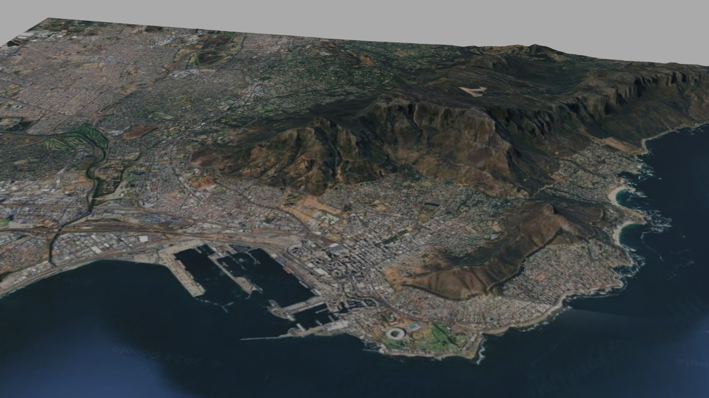

https://github.com/domlysz/BlenderGIS  

- on the right, there is releases...
- v2.2.8 is the current latest -> download source code (./BlenderGIS-228.zip)
- open blender -> edit -> preferences -> add-ons -> install -> point to the downloaded zip to install BlenderGIS add-on
- once installed -> (view/select/add/object/GIS) notice GIS menu button
 
#### google maps directly in blender
- GIS -> web geodata -> base map
- G (search for area)
- when area decided.. press "e" (plugin gives error but thats fine)
- material preview mode: you now have a flat cutout of your area

#### get elevation
- GIS -> web geodata -> get elevation (SRTM)
- server: OpenTopography 30m (sign up for api key: opentopography.org)
- once elevation is imported, blender adds this as a Texture Displacement modifier to a plane
- add subdivision surface modifier (move it before the displace modifier): set levels viewport to 4
- by default the elevation data is accurate (realistic) by you can change z-scale in object menu (right panel)
- materials -> roughness: 1.0
- add light (sun: strength 10) OR even better instead of adding a light: shader type: world (shading viewport) add node (search "sky texture")
- you can mute a node in shading viewport (M)

#### TODO:
- you can add solidify to the land (thickness of canvas)
- add a cube and make it look like seawater (settings: roughness 0.1, transmission weight 1, blueish color, principled volume with very low density 0.0002)
- https://www.youtube.com/watch?v=xrh4apJKhrs&ab_channel=ClickbaitScience
